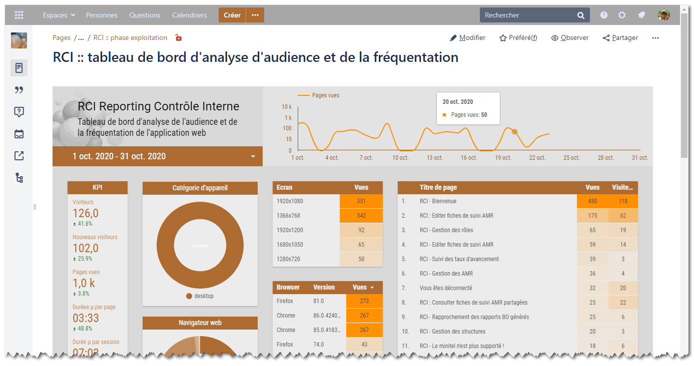
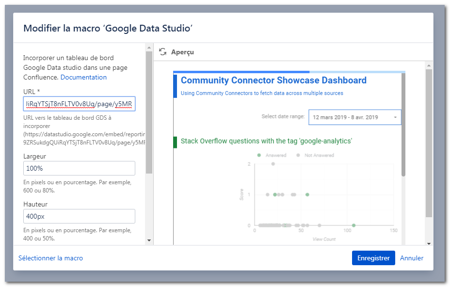
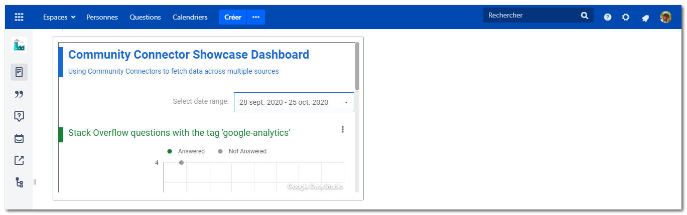
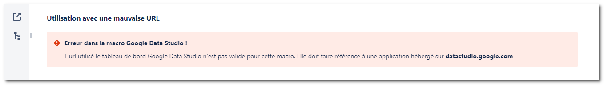

# Confluence user macro : Google Data Studio

> A Confluence User Macro to add into a Confluence page a report or dashboard of Google Data Studio (GDS).

## Features

**Insert and interact with a Google Data Studio's report into a Confluence Page**

This user macro give ability to insert a GDS's report into a Confluence page. To see a GDS's report or dashboard in Confluence, don't forget to give access to it in GDS administration. Only user with a valid and activate Google Account can see a GDS's document.

As an embed document, the user can interact with it in Confluence's page, and especially to select the date range or choose another filter in the report.



**Another features**

- Set URL of GoogleDataStudio's report. When the macro is used, it checks if given URL is valid ;
- Set height and widht with pixel or percent ;
- Add border and set its color ;
- Set background color ;


<br/>

## Parameters

Confluence User macros are useful if you want to create your own custom macros. These can be to perform specific actions, apply custom formatting and much more. You can specify parameters for your macro, so that users can pass it information to determine its behavior on a Confluence page. Confluence user macros can be write with Velocity templating language.

More information about **user macro** and **velocity template language** here :
- https://confluence.atlassian.com/doc/writing-user-macros-4485.html
- https://confluence.atlassian.com/doc/user-macro-template-syntax-223906130.html
- https://velocity.apache.org/engine/1.7/user-guide.html

ConfluenceUserMacroGoogleDataStudio uses a lot of different parameters to modify its behavior, define as follows :
```
## @param GoogleDataStudioUrl:title=URL|type=string|required=true|desc=URL vers le tableau de bord GDS à incorporer (https://datastudio.google.com/embed/reporting/1se-9ZRSukdgQUiRqYTSjT8nFLTV0v8Uq/page/y5MR)
## @param width:title=Largeur|type=string|desc=En pixels ou en pourcentage. Par exemple, 600 ou 80%.|default=100%
## @param height:title=Hauteur|type=string|desc=En pixels ou en pourcentage. Par exemple, 400 ou 50%.|default=400
## @param border:title=Ajoute une bordure|type=boolean|default=false
## @param blocBgColor:title=Couleur de fond du bloc|type=string|desc=Pour changer la couleur de fond.
## @param blocBorderColor:title=Couleur de la bordure du bloc|type=string|desc=Pour changer la couleur de la bordure.
```

More details on parameters of ImageCompare :

Parameter | Description
----------|------------
`GoogleDataStudioUrl` | Defines the URL of embed GoogleDataStudio's report. Don't forget to use the Embed Code option from the Embed Report feature in Data Studio. In order to test this macro, you can use the following example, https://datastudio.google.com/embed/reporting/1se-9ZRSukdgQUiRqYTSjT8nFLTV0v8Uq/page/y5MR, available in read only mode, and given by Google.
`height` and `width` | Set with pixel ('500px') or with percent (80%).
`border` | To add a border (true/false).
`blocBorderColor` | Set the border color.
`blocBgColor` | Set the background color.


<br/>

## Usages

To add the GDS's report example https://datastudio.google.com/embed/reporting/1se-9ZRSukdgQUiRqYTSjT8nFLTV0v8Uq/page/y5MR, just fill the form of this macro.



If given URL is valid, we obtain :



And if given URL is not valid, we obtain :




<br/>

## Licence

Copyright (c) 2019. 6i by 2o1oo <vb20100bv@gmail.com>

Release under [MIT](./LICENSE.md) license.